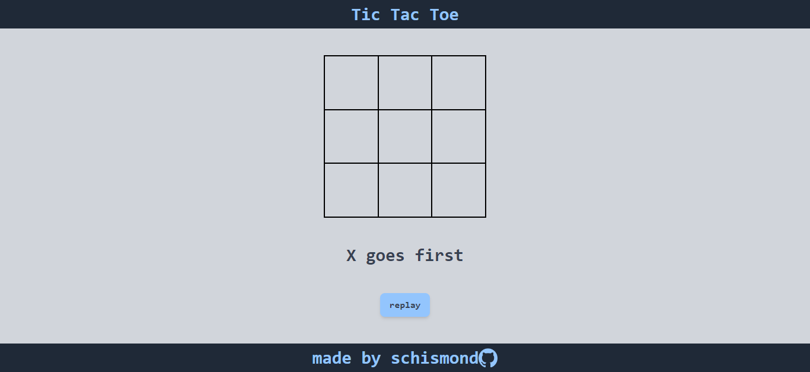

# Tic Tac Toe

This is a Tic Tac Toe game built as a part of [The Odin Project](https://www.theodinproject.com/)'s curriculum. The game is built using JavaScript, HTML and CSS.

## Features

- The game is played between two players. 
- Players can choose to be X or O.
- The player who succeeds in placing three of their marks in a horizontal, vertical, or diagonal row wins the game.
- In case no one is able to achieve this, the game results in a draw.
- The game also has a reset button to start a new game.

## Live Demo

[Click here](https://schismond.github.io/Tic-Tac-Toe/) to view a live demo of the game.

## Installation

To play the game on your local machine, follow these steps:

1. Clone this repository using the command below.

git clone https://github.com/schismond/Tic-Tac-Toe.git

2. Navigate to the project directory

3. Open the `index.html` file in your browser.

## Screenshots

## Built With

- Semantic HTML5 markup
- CSS custom properties
- Flexbox
- CSS Grid
- Mobile-first workflow
- Tailwind - CSS framework

## Show your support

Give a ⭐️ if you like this project!

## Acknowledgments

- [The Odin Project](https://www.theodinproject.com/)